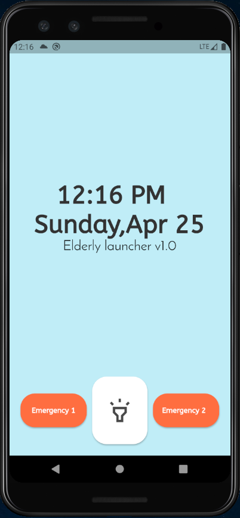

# Elderly Launcher
### _Android Launcher app for Seniors_

`Version : 1.0.0`

Elderly Launcher is a Simplified, Uncomplicated android launcher that aims to make the usage of smartphones easier and less complex for senior citizens who find it difficult to use the default launcher.

&nbsp;

## Features
&nbsp;
- Simple UI
- Select and display specific Apps in the apps menu
- Close and Emergency contacts with pictures - Click to call functionality
- Medicine Reminder and Details, resets ticked off medicines next day
- News Feed and News description page upon clicking read more
- More Features to be added ...

&nbsp;

### Some screenshots of the App

&nbsp;

 &nbsp;&nbsp; 

  
 &nbsp;&nbsp;

  
 &nbsp;&nbsp;

  

## Tech

 

|  |  |
| ------ | ------ |
| Language | Dart |
| Framework | Flutter |
| APIs called | Newsapi |
| Database | Sqflite |
| Key-Value storage | Shared Preferences |
 

## License

[GNU General Public License v3.0](/LICENSE)
